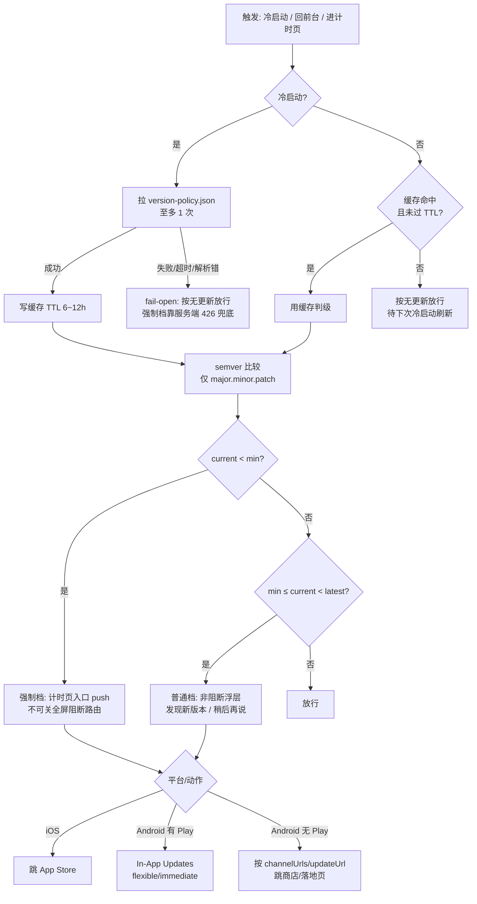

# App 版本更新 / 强制更新 — 设计 / 协议文档 v1.1

> 状态：**设计定稿，待实施**（实施在独立 session 的 worktree 进行；测试清单后补）。
> 与 Track B 同步传输解耦：版本策略下发走静态分发，不依赖 sync 应用逻辑。

## 0. 一句话目标
App 启动链/进入计时页时校验版本：低于「最新版本」→ 软提示（可"稍后再说"）；
低于「最低可用版本」→ 强制更新（不可关闭弹窗 + 服务端接口硬拦截）。
**默认全是软提示**，强制是后台应急开关。

## 1. 范围 / 非目标
**本期（v1）**：iOS + Android 双平台；普通更新 + 强制更新两档；服务端版本策略下发 +
启动校验 + 商店跳转/Android 应用内更新 + 服务端核心接口兜底拦截。
**非目标（v1 不做）**：渠道灰度（`targetChannel`）、定时生效（`effectiveTime`）、
强制更新的 A/B、应用内增量热更（合规不做）。日后需要再加。

## 2. 核心决策
| 维度 | 决策 |
|---|---|
| 强制 vs 软提示 | **默认软提示**；强制是「后台抬高 `minSupportedVersion`」触发的应急档 |
| 平台 | iOS + Android 同时；策略按 platform 分键（发版节奏不同） |
| 策略下发 | **nginx 后静态 JSON**（复用云备份/同步的 nginx/ECS/systemd 部署套件，但**不复用 sync 应用逻辑/DB**，故障域隔离）；**同主域 + URL path 区分版本/渠道，不新建子域**；客户端拉不到时 **fail-open** |
| 服务端兜底 | sync/backup 及日后核心 API 的**轻量中间件**：请求头 app 版本 < min → 返回 `426 Upgrade Required`（或自定义码）→ App 进强制页 |
| 版本比较 | **semver 数值比较**（major.minor.patch），不按字符串 |
| iOS 更新动作 | 无应用内更新，**跳 App Store**（`itms-apps://` / https 商店链接） |
| Android 分发 | **Play + 国内多商店并存**：渠道标识走 **`--dart-define=APP_CHANNEL`**（编译期注入，Dart/原生双端可读，不改签名块/包名，过国内商店渠道校验）；运行时探测 Play Services 是否可用 |
| Android 更新动作 | **有 Play Services**：普通档 flexible / 强制档 immediate（Play In-App Updates）。**无 Play（国内主路径）**：退化为「跳商店/官网落地页」，与 iOS 同构；强制档靠不可关弹窗 + 服务端 426 兜底 |
| 版本号粒度 | 仅比 `major.minor.patch`；`buildNumber`（`1.4.0+12` 的 `+12`）按 semver 规范属 metadata，**不参与判级**（hotfix 重打 build 不误触） |

## 3. 两档模式
| 模式 | 触发条件 | 体验 | iOS | Android（有 Play） | Android（无 Play） |
|---|---|---|---|---|---|
| **普通（默认）** | `current < latestVersion` | 弹窗「发现新版本」，可「稍后再说」 | 跳 App Store | flexible update | 跳商店/官网落地页 |
| **强制（应急）** | `current < minSupportedVersion` | 不可关闭弹窗 + 服务端拦截，功能不可用 | 不可关弹窗 → 跳 App Store | immediate update | 不可关弹窗 → 跳商店/落地页 + 服务端 426 兜底 |

平时 `minSupportedVersion` 设得足够低 → 无人被挡，全软提示。仅安全漏洞/接口不兼容/
重大合规时，后台把 `minSupportedVersion` 抬上去，对应区间用户进入强制档。
> iOS 强制档弹窗即便"不可关"也挡不住用户切后台；靠「回前台重弹 + 服务端拦截」组合，
> 让旧版本功能上用不了即可。强制开关必须支持后台随时下调/关闭。

## 4. 数据模型（策略 JSON，静态下发）
按平台分键，同主域 path 区分（不新建子域），例如 `GET https://<host>/app/version-policy.json`：
```json
{
  "ios": {
    "latestVersion": "1.4.0",
    "minSupportedVersion": "1.0.0",
    "updateUrl": "itms-apps://apps.apple.com/app/idXXXXXXXX",
    "title": "发现新版本",
    "content": "更新以获得更稳定的体验。"
  },
  "android": {
    "latestVersion": "1.4.0",
    "minSupportedVersion": "1.0.0",
    "updateUrl": "https://<host>/download",
    "channelUrls": {
      "xiaomi": "mimarket://details?id=...",
      "huawei": "appmarket://details?id=...",
      "oppo": "oppomarket://details?packagename=...",
      "vivo": "vivomarket://details?id=...",
      "tencent": "market://details?id=...",
      "official": "https://<host>/download",
      "play": "https://play.google.com/store/apps/details?id=..."
    },
    "title": "发现新版本",
    "content": "更新以获得更稳定的体验。"
  }
}
```
- `forceUpdate` 不单独存字段：由 `current < minSupportedVersion` 推导，避免双源不一致。
- 文案可平台各异；缺字段时客户端用内置兜底文案。
- **Android `updateUrl` 选取**：客户端读编译期 `APP_CHANNEL`（`String.fromEnvironment('APP_CHANNEL')`），命中 `channelUrls[channel]` 则直跳对应商店（`market://`/`mimarket://` 等 scheme，未安装该商店则回退到 `updateUrl` 落地页）；未命中（含 `APP_CHANNEL` 未注入）用 `updateUrl`（官网落地页，按 UA/渠道自助引导）。`channelUrls` 全缺失时一律用 `updateUrl`。
  - **渠道枚举（`APP_CHANNEL` / `channelUrls` key 命名空间，固定七值）**：`xiaomi` / `huawei` / `oppo` / `vivo` / `tencent`（应用宝）/ `official`（官网）/ `play`（Google Play）。
  - 打包：`flutter build apk --dart-define=APP_CHANNEL=xiaomi`，CI 一行切渠道，不改签名块/包名。
- **iOS 无 `channelUrls`**（单一 App Store）。

## 5. 客户端流程
1. **触发点**：冷启动后、从后台回前台、**进入计时页**时各做一次（带节流）。
2. **节流/缓存（固定规则）**：**每次冷启动至多拉 1 次**版本策略，结果缓存 **TTL 6–12h**；**热启动/切前台不重复请求**，直接用缓存判级。计时页等高频入口只触发判级、不触发网络拉取（缓存未命中且非冷启动时按"无更新"放行，等下次冷启动刷新）。
3. **比较**：取本地 `packageInfo.version`（semver）与对应 platform 的 latest/min 比较。
4. **判级**：
   - `current < min` → 强制档：在**默认首屏（计时页）入口**触发，push 一个**不可关全屏阻断路由**（盖住 tab 框架，仅「立即更新」、PopScope 拦返回），使旧版本功能上用不了。**真正的硬强制由服务端 426 保证（§6）**；客户端这层是 best-effort，故不挂在启动链最外层（避免改 `main.dart`/根 gate 的高 blast radius），而是复用页面入口触发。
   - `min ≤ current < latest` → 普通档：非阻断浮层「发现新版本 / 稍后再说」。
   - 否则放行。
5. **「立即更新」**：
   - iOS：跳 App Store。
   - Android：先探测 Play Services（如 `google_api_availability`）。可用 → Play In-App Updates（flexible/immediate）；不可用 → 按 §4 选取 `updateUrl`/`channelUrls` 跳商店或落地页。探测失败一律按"无 Play"退化。
6. **fail-open**：策略接口拉取失败（超时/解析失败）→ **不阻断**，按"无更新"处理（不能因策略接口挂了把 App 锁死）。强制档的真正兜底是服务端拦截（见 §6）。
7. **缓存与强制档实时性**：缓存只影响**软提示**弹得快不快；应急抬高 `minSupportedVersion` 时，持旧缓存用户的强制档实时性**由服务端 426 保证**（见 §6），不依赖客户端缓存过期 → 该延迟可接受。

### 5.1 判级流程图


## 6. 服务端兜底拦截
- 客户端所有走真实后端的 API（sync/backup，及日后核心接口）统一在请求头带
  `X-App-Version` / `X-Platform`（在 `HttpCloudApiClient` 一处注入，全 API 生效）。
- 后端中间件：`X-App-Version < minSupportedVersion(platform)` → `426 Upgrade Required`
  + 错误体（含 updateUrl/文案）。App 把该码映射到强制更新页。
- **不拦截** `version-policy.json` 自身与登录/版本检查相关端点（避免鸡生蛋）。
- 拦截只在调这些 API 时才发生，故与"策略下发可用性"无耦合。
- **分层口径**：426 是 **HTTP 传输层**信号，在 `HttpCloudApiClient` 解析业务 `ApiResponse` **之前**短路处理（不混进业务错误码体系，用独立 `upgrade_required` 码）。**映射机制**：因 sync caller 会把异常吞成 `failed` 结果、且传输层无 `BuildContext`/无全局 navigatorKey，故**不靠抛异常路由**，改为：426 → 触发注入的 `onUpgradeRequired(decision)` sink → `ForcedUpdateController` 经**全局 navigatorKey** push 强制页（去重,复用 V4 forced blocker + V5 渠道投递）。错误体（updateUrl/文案）按需解析,缺失用内置兜底文案。
- **实施拆片**：**V6a** 客户端=头注入 + 426 检测/映射(transport sink + navigatorKey + ForcedUpdateController);**V6b** 服务端=sync/backup 中间件(读头比 min → 426,放行 policy/登录/版本端点)。注:V6b 落地前客户端不会真收到 426,V6a 的映射路径靠单测模拟 426 验证。

## 7. 故障域 / 稳定性
- 策略下发 = 静态文件 + nginx：即便 brand-new 的 sync 服务抖动，版本检查照常 → App 启动不受其拖累。满足「复用稳定就复用、有隐患就独立」：**复用部署基础设施，隔离应用逻辑故障域**。
- 客户端 fail-open + 服务端硬拦截 = 双保险：策略接口可用性问题不锁死用户；真要挡旧版本由服务端中间件保证。

## 8. 与现有启动链共存
现状启动链：`SubscriptionService.init` / 手机登录 / `sync_lifecycle_gate`（appStart+前台恢复驱动 sync）。
- **强制档不挂在启动链最外层**（不改 `main.dart`/根 gate，避免高 blast radius）。改为在**默认首屏（计时页）入口**复用版本检查触发器：forced → push 不可关全屏阻断路由，盖住 tab 框架。计时页是 index 0 默认 tab，冷启动几乎所有人都落此页 → 强制阻断在启动后即弹，覆盖≈全部用户。
- 客户端强制只是 best-effort UX；**真正的硬强制是服务端 426**（§6，V6 落地）。downgrade-unblock（后台下调 `minSupportedVersion`）在下次冷启动重拉策略时生效（缓存 TTL/§5.7）。
- 普通档为非阻断浮层，进计时页时弹，不影响其它流程。

## 9. 实施切片计划（交另一 session 的 worktree；每片跑全门禁、绿了推进）
- **V1** 静态策略 JSON 格式 + 后端 nginx 下发位（复用部署套件；文档化更新方式）。
- **V2** 客户端版本检查服务（semver 比较 + 拉策略 + 缓存/节流 + fail-open）+ 单测。
- **V3** 普通档 UI：非阻断「发现新版本/稍后再说」浮层；接计时页入口触发。
- **V4** 强制档 UI：扩展 V3 协调器，在计时页（默认首屏）入口对 forced 决策 push **不可关全屏阻断路由**（PopScope + 仅「立即更新」跳商店/落地页）；**不改 `main.dart`/根 gate**。Play immediate in-app update 留 V5。
- **V5** Android 双路径更新动作：渠道标识读取 + Play Services 探测；有 Play → flexible/immediate（Play In-App Updates）；无 Play → 按 `channelUrls`/`updateUrl` 跳商店或落地页（与 iOS 同构）。强制档无 Play 时靠不可关弹窗 + 服务端 426 兜底。
- **V6a** 客户端：`HttpCloudApiClient` 一处注入 `X-App-Version`/`X-Platform`；426 检测 → `upgrade_required` 短路 + `onUpgradeRequired` sink → `ForcedUpdateController` 经全局 navigatorKey push 强制页（复用 V4/V5）。单测模拟 426。
- **V6b** 服务端：sync/backup（`server/cloud_sync_backend`、`cloud_backup_backend`）轻量中间件——读头比 `minSupportedVersion(platform)` → `426 Upgrade Required` + 错误体；**放行** `version-policy.json`/登录/版本端点。
- **V7** i18n（弹窗标题/正文/按钮入 l10n，遵守只抽 UI 串纪律）+ 端到端联调。

## 10. 留待实施时敲定
- iOS 商店链接形态（`itms-apps://` vs https）与 App Store id 占位。
- iOS 商店链接形态最终取 `itms-apps://` 还是 https，及 App Store id 实值（占位待填）。
- Android 插件选型：`in_app_update`（Play In-App Updates）+ Play Services 探测（`google_api_availability` 或自写 platform channel）；`mimarket://`/`appmarket://`/`oppomarket://`/`vivomarket://`/`market://` 各 scheme 兼容性与未安装回退实测。

### 已敲定（从本节迁出，落在正文）
- ~~semver build 号比较~~ → 仅比 `major.minor.patch`，buildNumber 不参与（§2）。
- ~~426 与错误码体系兼容~~ → HTTP 层短路、不混业务码（§6 分层口径）。
- ~~Android 非 Play 退化~~ → 双路径 + `channelUrls`（§2/§3/§4/§5）。
- ~~渠道标识机制~~ → `--dart-define=APP_CHANNEL`，七值枚举（§2/§4）。
- ~~策略下发 host 形态~~ → 同主域 + URL path，不新建子域（§2/§4）。
- ~~缓存 TTL / 触发节流~~ → 冷启动至多 1 次拉取 + TTL 6–12h + 热启动不重复（§5.2）。
